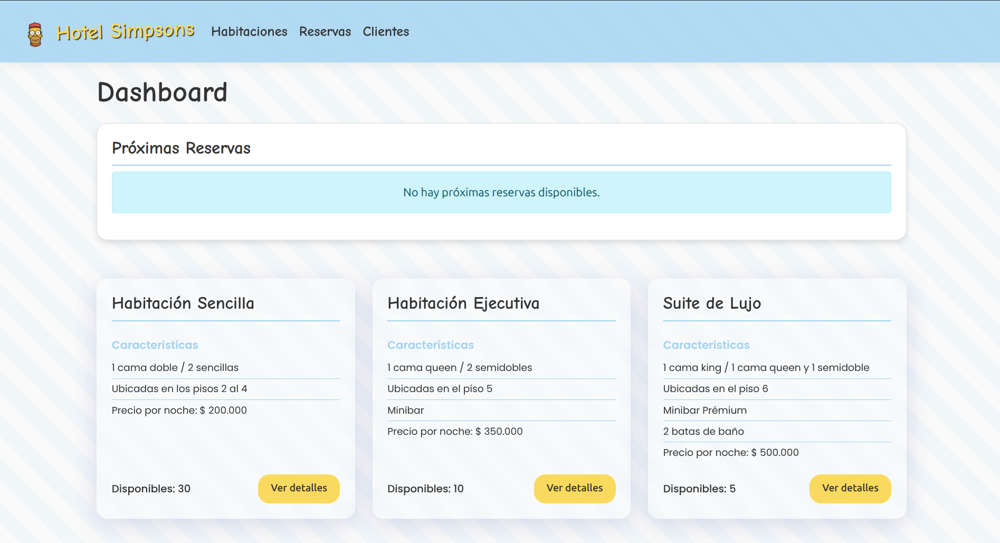

# Hotel Simpsons

  

Este proyecto implementa un sistema completo de gestión para el Hotel Simpsons, desarrollado como parte de un curso de Paradigmas de Programación. El sistema permite administrar reservas, habitaciones, clientes, servicios y todo lo relacionado con la operación del hotel.

## Estructura del Proyecto

El proyecto está estructurado en tres partes principales:

### 1. Core (SimpsonsHotel.Core)

Este proyecto contiene todas las clases del dominio, interfaces y lógica de negocio del hotel:

- **Classes**: Contiene las clases principales del dominio:

  - Habitaciones (`Habitacion`, `Sencilla`, `Ejecutiva`, `Suite`)
  - Personas (`Persona`, `Cliente`, `Huesped`)
  - Gestión (`Hotel`, `Oficina`, `Recepcion`)
  - Servicios (`Restaurante`, `Lavanderia`, `Minibar`, etc.)
  - Documentos (`Factura`, `Reserva`, etc.)
  - Configuración (`ConfiguracionHotel`)

- **Interfaces**: Define los contratos que implementan algunas clases:

  - `IMinibar`: Interfaz para los tipos de minibar

- **Events**: Implementa el patrón Observer para eventos del hotel:

  - `EventosHotel`: Eventos como check-in, check-out, consumos, etc.
  - `EventoReservaCancelada`: Notificaciones para reservas canceladas

- **Aspects**: Implementa el patrón Aspect-Oriented Programming (AOP):
  - `AutenticacionAspect`: Para validación de accesos
  - `CargaArchivoAspect`: Para el manejo de archivos
  - `ValidacionAspect`: Para validar datos de entrada

### 2. App (Aplicación Web)

Este proyecto es una aplicación web ASP.NET Core MVC que actúa como interfaz de usuario para el sistema:

- **Controllers**: Controladores para gestionar las solicitudes HTTP:

  - `HomeController`: Gestiona la página principal
  - `HabitacionController`: Gestiona las habitaciones
  - `ClienteController`: Gestiona los clientes
  - `ReservaController`: Gestiona las reservas
  - `ServiciosController`: Gestiona los servicios del hotel

- **Views**: Vistas organizadas por controlador y función:

  - Habitación: `Detalle.cshtml`, `Index.cshtml`, `Reservar.cshtml`, etc.
  - Cliente: `Crear.cshtml`, `Detalles.cshtml`, etc.
  - Reserva: `CheckIn.cshtml`, `CheckOut.cshtml`, etc.
  - Home: `Index.cshtml`

- **ViewComponents**: Componentes reutilizables:

  - `RoomCard`: Para mostrar tarjetas de habitaciones
  - `RoomTypeCard`: Para mostrar tipos de habitaciones
  - `CheckInCard`: Para el proceso de check-in
  - `CheckOutCard`: Para el proceso de check-out
  - Entre otros

- **ViewModels**: Objetos específicos para las vistas:

  - `ReservaViewModel`: Para la creación de reservas

- **wwwroot**: Archivos estáticos (CSS, JS, imágenes)

### 3. Demo (Cliente de Consola)

Aplicación de consola para demostraciones y pruebas del sistema:

- `Program.cs`: Punto de entrada
- `clientes.csv`: Datos de ejemplo

## Patrones de Diseño Implementados

Este proyecto implementa varios patrones de diseño orientados a objetos:

1. **Singleton**: La clase `Hotel` implementa el patrón Singleton para garantizar una sola instancia.

2. **Observer**: Las clases en el namespace `SimpsonsHotel.Core.Events` implementan este patrón para comunicar eventos como check-in, check-out y cancelaciones.

3. **Factory Method**: Para la creación de diferentes tipos de habitaciones.

4. **Strategy**: Para diferentes estrategias de cálculo de costos según el tipo de habitación.

5. **Herencia y Polimorfismo**: Las clases de habitaciones (`Sencilla`, `Ejecutiva`, `Suite`) heredan de la clase abstracta `Habitacion`.

6. **Composición**: Cada habitación contiene componentes como `Minibar` y `Consumo`.

7. **Aspect-Oriented Programming (AOP)**: Implementado en el namespace `SimpsonsHotel.Core.Aspects`.

## Características del Sistema

### Tipos de Habitaciones

1. **Sencilla**:

   - Ubicadas en los pisos 2 al 4
   - Precio por noche: $200,000
   - Tipos de cama: Cama doble o dos camas sencillas
   - No incluye servicios premium

2. **Ejecutiva**:

   - Ubicadas en el piso 5
   - Precio por noche: $350,000
   - Tipos de cama: Cama queen o dos camas semidobles
   - Incluye minibar con: 4 Botellas de Licor, 2 Botellas de Agua, 1 Kit de Aseo Personal, 2 Gaseosas

3. **Suite**:
   - Ubicadas en el piso 6
   - Precio por noche: $500,000
   - Tipos de cama: Cama king o una cama queen y una semidoble
   - Incluye minibar premium con: Botella de Vino, 4 Botellas de Licor, 3 Kits de Aseo Personal, 4 Gaseosas
   - Incluye 2 batas de baño (con opción de comprar adicionales)

### Procesos de Negocio

1. **Reservas**:

   - Crear reserva para cualquier tipo de habitación
   - Cancelar reserva
   - Ver detalles de reserva

2. **Check-in/Check-out**:

   - Proceso de check-in con asignación de habitación
   - Proceso de check-out con generación de factura
   - Gestión de huéspedes

3. **Servicios**:

   - Restaurante (desayuno, almuerzo, cena)
   - Servicio a la habitación
   - Lavandería
   - Minibar personalizado por tipo de habitación

4. **Facturación**:
   - Cálculo automático de costos basado en la estancia
   - Aplicación de IVA (19%)
   - Seguro hotelero (2.5%)
   - Registro de consumos adicionales

## Capturas de Pantalla

### Dashboard Principal

### Gestión de Reservas

### Gestión de Habitaciones

### Servicios y Facturación

## Requisitos del Sistema

- .NET Core 8.0
- SQL Server (opcional para persistencia)
- Visual Studio 2022 o Visual Studio Code

## Cómo Ejecutar el Proyecto

1. Clona el repositorio
2. Abre la solución en Visual Studio 2022 o Visual Studio Code
3. Restaura los paquetes NuGet
4. Ejecuta el proyecto web `app`
